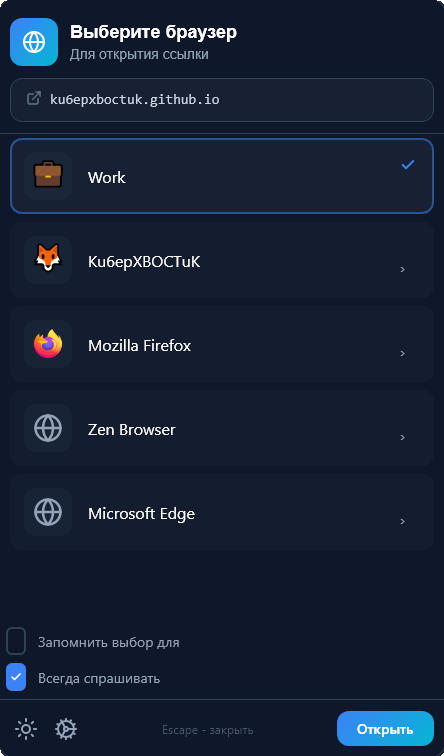
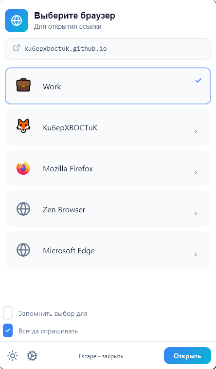

<div align="center">


# bropicker

Лёгкий переключатель браузеров: кликаешь ссылку — bropicker спрашивает, каким браузером её открыть.

**Rust + Slint, нативный рендер без WebView, cold start ~110 ms.**

<a href="https://slint.dev"></a>

&nbsp;

</div>

## Возможности

- Frameless-окно с прозрачностью, перетаскивание за хедер, Esc — закрыть
- Тёмная и светлая темы
- Автодетект установленных браузеров из реестра (Firefox, Chrome, Edge, Zen, Opera, Brave, Яндекс…)
- Запоминание выбора по домену: повторные ссылки открываются сразу, без вопроса
- Галочка «Всегда спрашивать» — пикер вызывается даже для запомненных доменов
- Несколько профилей одного браузера как отдельные записи (флаги + эмодзи-иконка)
- Конфиг в TOML, открывается кнопкой шестерёнки

## Сборка

```powershell
cargo build --release
```

## Установка обработчиком ссылок

```powershell
tools\register.ps1        # скопирует сборку в %LOCALAPPDATA%\bropicker и откроет настройки Windows
```

В открывшемся окне выбери **bropicker** для HTTP и HTTPS. Откат: `tools\register.ps1 -Uninstall`.

## Конфигурация

`%APPDATA%\bropicker\config.toml` (шестерёнка в пикере открывает его в редакторе).
Пример с профилями и эмодзи: [docs/config.example.toml](docs/config.example.toml).

```toml
[[browsers]]
name = "Chrome — Work"
path = 'C:\Program Files (x86)\Google\Chrome\Application\chrome.exe'
flags = '--profile-directory="Default"'
emoji = "💼"

[remembered]
"github.com" = "Chrome — Work"

[settings]
remember_choice = true
always_ask = true
```

## Разработка

```powershell
just check          # fmt + clippy -D warnings + тесты
just screenshots    # перегенерация скриншотов README (тёмная + светлая)
just icons          # перегенерация иконок из assets/icon.svg
just release        # release-сборка
just register       # установка/обновление обработчика ссылок
```

То же напрямую: `tools\check.ps1`, `tools\screenshots.ps1`, `tools\register.ps1`.
Планы и процесс: [docs/dev-workflow.md](docs/dev-workflow.md).

## Лицензия

Код bropicker — [MIT](LICENSE).

Интерфейс построен на [Slint](https://slint.dev), который используется по
[Slint Royalty-free License 2.0](licenses/Slint-Royalty-free-2.0.md)
Текст лицензии также входит
в состав установки (`licenses/`).

Логотипы браузеров — [alrrr/browser-logos](https://github.com/alrrr/browser-logos), MIT
([LICENSE](logos/LICENSE-browser-logos.txt)).
